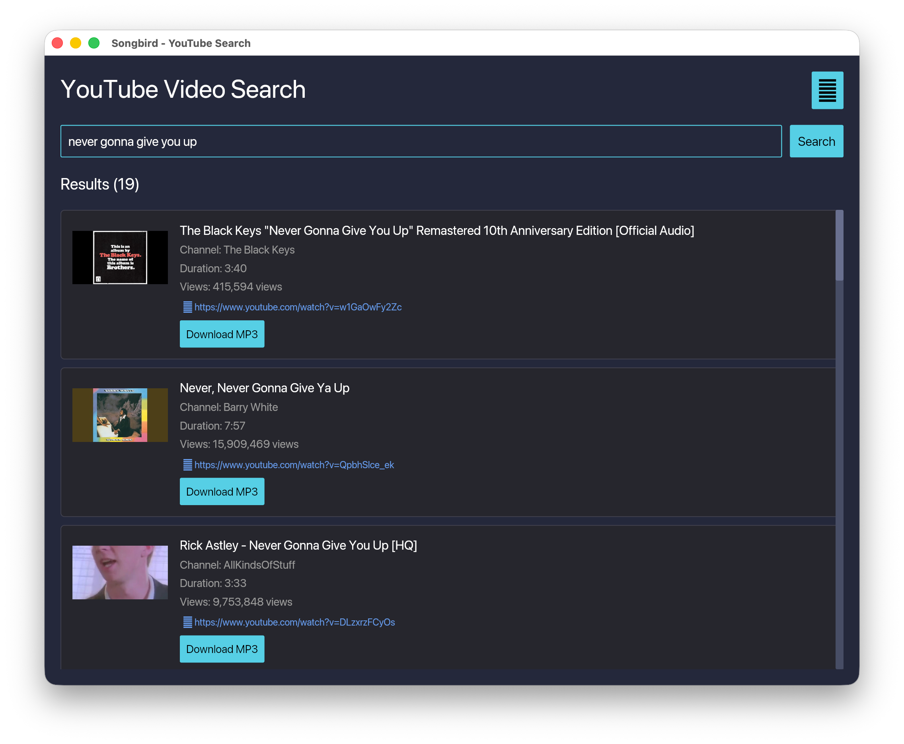

# Nightingale 🎵

A desktop application for searching YouTube videos and downloading them as MP3 files.

Built with Rust and the Iced GUI framework.



## Features

- 🔍 Search YouTube with natural language queries or paste URLs/playlists
- 📊 Smart ranking of results (official audio versions prioritized)
- 💾 Download videos as MP3 files
- 📱 **One-click transfer to iPhone** (AirDrop on macOS, Wi-Fi on Linux)
- 🎨 Clean, native desktop interface
- 📝 Customizable filenames before download
- 📋 View detailed download logs for troubleshooting

## Installation

### From crates.io

```bash
cargo install nightingale
```

Then run:
```bash
nightingale
```

### From source

```bash
git clone https://github.com/ehamiter/nightingale.git
cd nightingale
cargo build --release
./target/release/nightingale
```

## First-Time Setup

1. Launch Nightingale
2. Click the ⚙️ settings button
3. Set your preferred download directory
4. If yt-dlp is not installed, click "Install yt-dlp" (or install manually with `brew install yt-dlp`)

## Usage

1. **Search**: Enter an artist/song name or paste a YouTube URL/playlist
2. **Preview**: Results are ranked by relevance (official audio prioritized)
3. **Download**: Click "Download MP3" and customize the filename
4. **Transfer to iPhone** (optional):
   - **macOS**: Click "Send via AirDrop" for instant wireless transfer
   - **Linux**: Click "Share via Wi-Fi" and scan the QR code with your iPhone camera
5. **Troubleshoot**: View logs if downloads fail

### Transferring to iPhone

After downloading an MP3, a green share button appears for that track:

**On macOS:**
- Click "Send via AirDrop"
- The macOS share sheet opens automatically
- Select your iPhone from the AirDrop options
- Accept on your iPhone

**On Linux:**
- Click "Share via Wi-Fi"
- A QR code appears on screen
- Scan the QR code with your iPhone camera
- Tap the notification to download the file

**Note:** Files transferred this way go to your iPhone's Downloads folder. They won't automatically appear in the Music app. Use VLC or the Files app for playback, or manually import them to Music.

## Requirements

- **yt-dlp**: Required for downloading videos
  - macOS: `brew install yt-dlp` or use the built-in installer
  - Linux: `pip install yt-dlp` or use the built-in installer
- **ffmpeg**: Required for audio conversion
  - macOS: `brew install ffmpeg`
  - Linux: `sudo apt install ffmpeg` (Debian/Ubuntu) or `sudo dnf install ffmpeg` (Fedora)

## Platform-Specific Builds

### macOS App Bundle

Create a double-clickable `.app`:

```bash
cargo build --release
./build_app.sh
open target/release/Nightingale.app
```

Install to Applications:
```bash
cp -r target/release/Nightingale.app /Applications/
```

### Linux Desktop App

Install as a desktop application (appears in app launcher):

```bash
cargo build --release
./build_linux.sh
```

The app will be available in your system's application menu.

## Custom Icon

To add your own icon:

```bash
./build_icon.sh path/to/your/icon.png
./build_app.sh  # macOS
./build_linux.sh  # Linux
```

Your icon should be a square PNG (512x512 or 1024x1024 recommended).

## License

MIT License - see [LICENSE](LICENSE) for details
